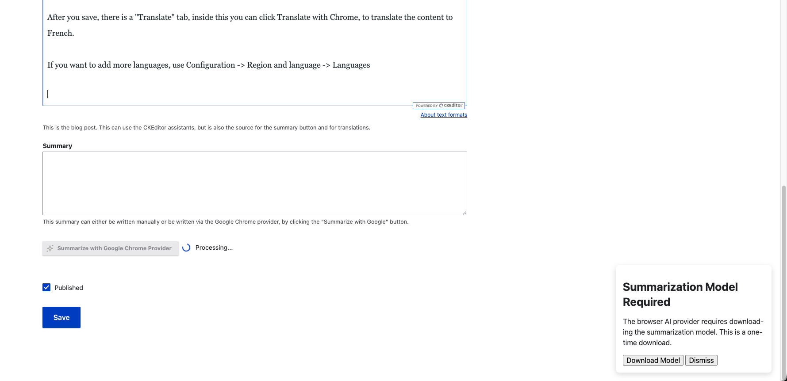
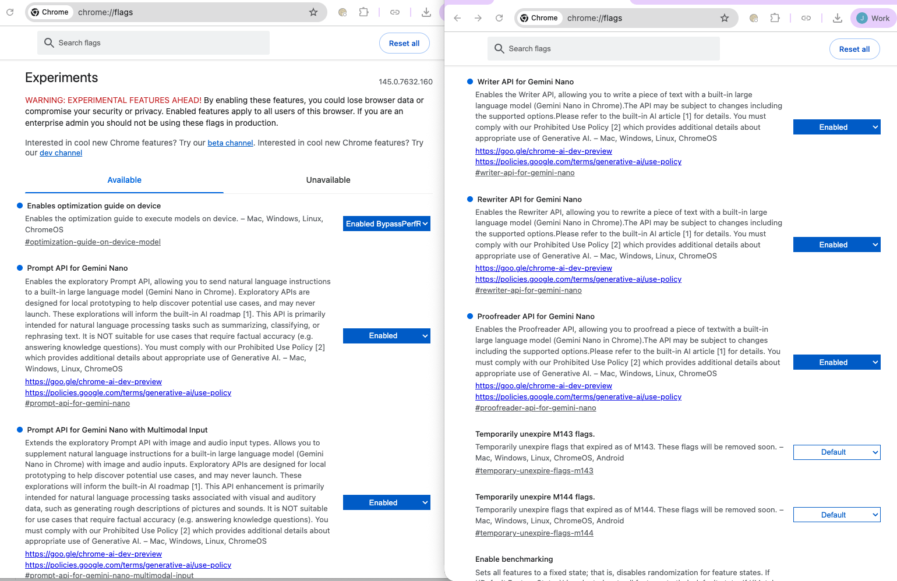
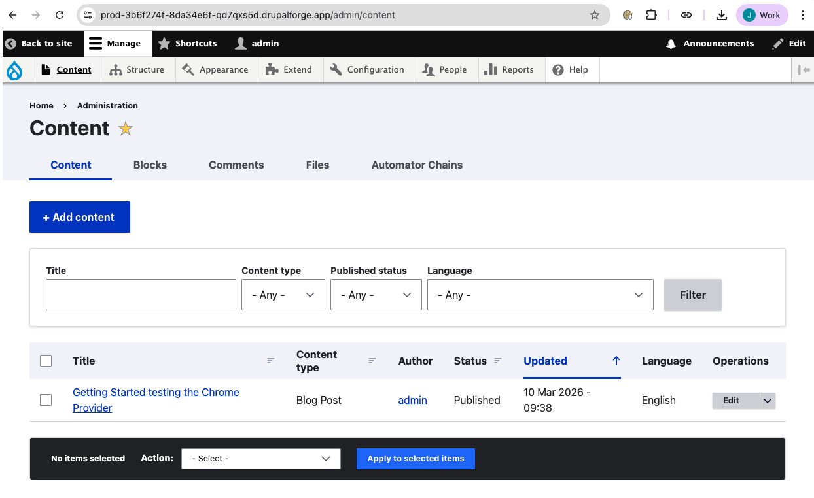
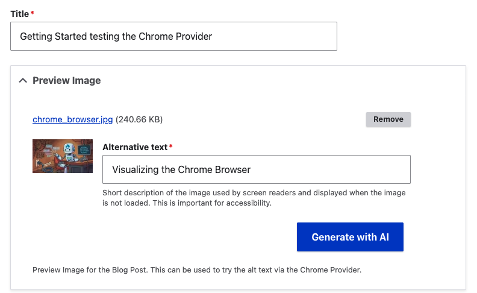
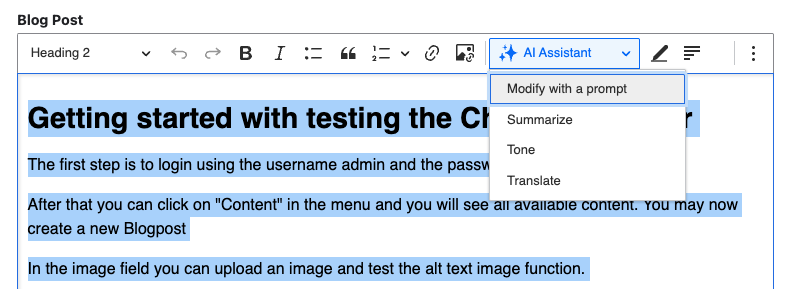
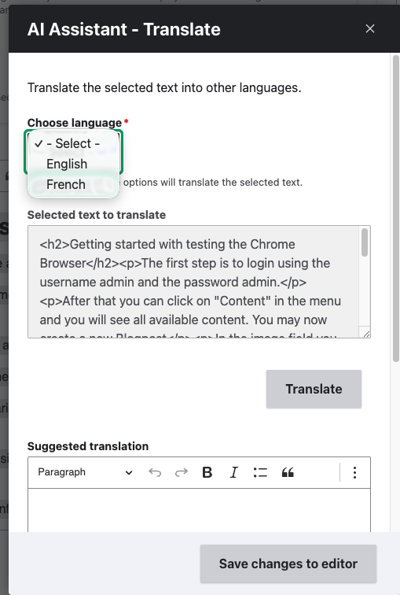
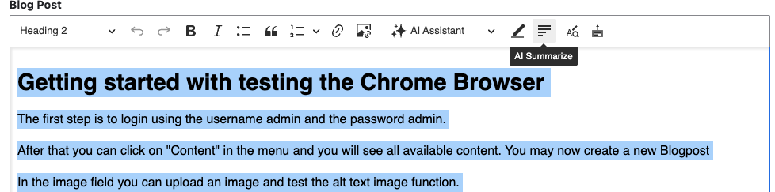
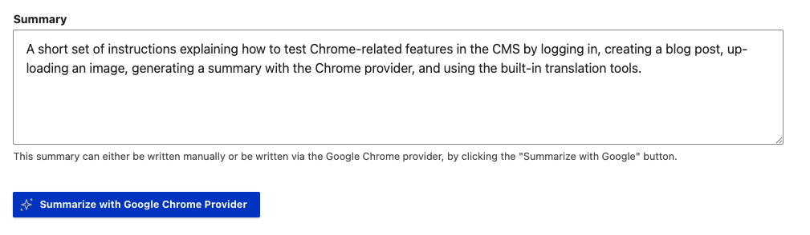
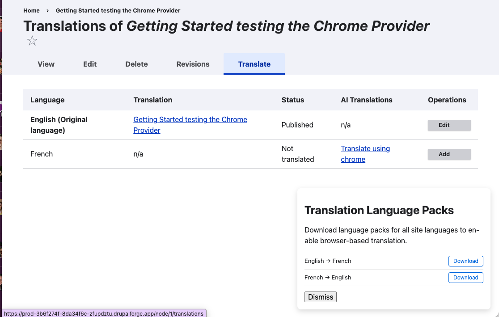

# Getting Started With The Chrome Browser Prompt API Demo

## Intended First-Run Journey (OOB)
1. Anonymous users should land on the login page first.
2. After login, users should land on this tutorial page.
3. Users should complete one-time setup, then test the listed features in order.

## What This Demo Is
This demo combines Drupal CMS AI features with a small AI model running locally in Chrome via the Prompt API and Gemini Nano.

It lets users test AI features without external API keys and highlights two usage patterns:
- Sovereign AI in Drupal workflows.
- Fully local browser AI interactions.

Note: local model execution is hardware dependent. 16GB RAM is recommended for better performance.

## One-Time Setup
### Download Gemini Nano in Chrome
If prompted, allow Chrome to download the local model.

### If you run this on your own host
This demo host is already registered for Chrome origin trials. On your own host, either register your domain for the relevant trials or manually enable required `chrome://flags`.

## Demo Credentials
For local demo/testing environments:
- Username: `admin`
- Password: `admin`

## Feature Walkthrough
### 1) Open content and edit a Blog Post
Go to **Content**, open or create a Blog Post, and add sample text and an image.

### 2) Generate Alt Text
Upload an image, then use the image field action to generate alt text.

### 3) Use CKEditor AI assistants
Highlight text in CKEditor and choose an assistant action:
- Summarise
- Translate
- Change tone

### 4) Try local-only browser AI actions
Highlight text and apply local AI actions such as summarise/proofread directly in the editor.

### 5) Summarise into Summary field
Use the **Summarize with Google Chrome Provider** button to fill summary content.

### 6) Translate content
Save the content, open **Translate**, and generate an English/French translation.

## Short Summary (For CMS Summary Field)
A quick tutorial for the Chrome Prompt API demo: log in, open content, test AI alt text, CKEditor assistants, local AI actions, summarization, and translation.
